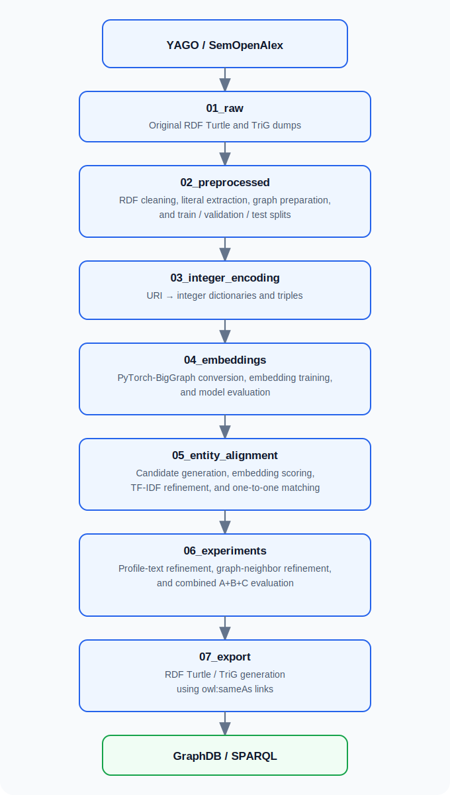
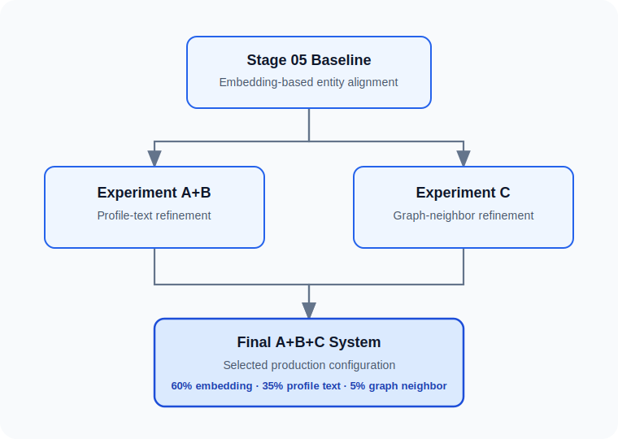

# Scalable Entity Alignment between YAGO and SemOpenAlex


This repository accompanies the Master's thesis

> **Scalable Entity Alignment between Large-Scale Heterogeneous Knowledge Graphs: A Case Study of YAGO and OpenAlex**

developed within the Master's Study Programme in Data Science at the University of Primorska.

The project investigates how large heterogeneous knowledge graphs can be aligned efficiently when they describe many of the same real-world entities but use different identifiers, schemas, and modeling conventions.

The work focuses on aligning **YAGO**, a large general-purpose knowledge graph, with **SemOpenAlex**, the RDF representation of the OpenAlex scholarly knowledge graph. Although both graphs contain millions of entities describing authors, publications, institutions, concepts, and other real-world objects, direct alignment is challenging because only a small fraction of entities share explicit identifiers.

Instead of relying solely on exact identifier matching or purely lexical similarity, this repository implements a scalable multi-stage entity alignment pipeline that progressively combines lexical, structural, and contextual evidence. Beginning with raw RDF datasets, the pipeline performs preprocessing, graph embedding generation, candidate generation, ambiguity resolution, experimental refinement, and finally exports the resulting alignments as RDF `owl:sameAs` links suitable for inspection in GraphDB and other Semantic Web tools.

The final production system predicts **1,973,194 one-to-one alignments** between YAGO and SemOpenAlex while remaining fully reproducible through a modular pipeline designed for large-scale execution on High Performance Computing (HPC) infrastructure.

Although the repository accompanies a Master's thesis, it is intended to serve not only as supporting material for the dissertation but also as a reusable research artifact that documents every stage of the alignment process—from raw RDF data to the final linked knowledge graph.


# The Entity Alignment Problem

Knowledge graphs frequently describe the same real-world entities while assigning them different identifiers, schemas, and levels of detail. As a result, information about a single person, publication, institution, or concept may be distributed across multiple independent knowledge graphs without any explicit connection between them.

Entity alignment is the task of automatically discovering these correspondences and determining which entities refer to the same real-world object.

For example, an author represented in YAGO and the same author represented in SemOpenAlex may contain nearly identical information while using completely different identifiers.

```text
YAGO
http://yago-knowledge.org/resource/Albert_Einstein

↓

SemOpenAlex
https://semopenalex.org/author/A5012345678
```

Although these resources describe the same person, there is often no direct link connecting them.

At first glance, the problem may appear straightforward because many entities share identical names. In practice, however, large knowledge graphs contain millions of ambiguous labels.

Examples include:

- multiple authors sharing the same name,
- journals with similar titles,
- institutions whose names changed over time,
- publications with identical or nearly identical titles,
- concepts that differ only by punctuation or capitalization.

Consequently, relying solely on exact string matching would introduce a large number of incorrect alignments, while relying only on graph structure would fail to exploit valuable lexical information.

The objective of this project is therefore not simply to match identical labels, but to progressively combine multiple complementary sources of evidence in order to distinguish truly equivalent entities from merely similar ones.

# Why YAGO and SemOpenAlex?

The pipeline developed in this repository focuses on aligning two large knowledge graphs with complementary characteristics.

## YAGO

YAGO is a large general-purpose knowledge graph constructed from multiple sources, including Wikipedia, Wikidata, and GeoNames. It represents a broad range of real-world entities such as people, organizations, locations, events, publications, creative works, and abstract concepts.

Because of its heterogeneous nature, YAGO provides a rich semantic representation of the world and has become one of the most widely used benchmark knowledge graphs in Semantic Web research.

More information about YAGO is available at:

https://yago-knowledge.org/


## SemOpenAlex

SemOpenAlex is an RDF representation of the OpenAlex scholarly knowledge graph.

Unlike YAGO, which covers many different domains, SemOpenAlex focuses specifically on scholarly information and contains entities describing:

- authors,
- research works,
- institutions,
- journals and sources,
- publishers,
- concepts,
- research topics,
- funding organizations.

The graph is published as RDF, making it well suited for Semantic Web applications and knowledge graph integration.

More information about OpenAlex is available at:

https://openalex.org/


## Why Align These Knowledge Graphs?

Although both knowledge graphs describe many of the same real-world entities, they were created for different purposes and therefore differ substantially in both structure and content.

YAGO emphasizes broad encyclopedic knowledge, while SemOpenAlex focuses on scholarly communication and research metadata.

Consequently, equivalent entities often appear in both graphs but are represented using different identifiers, different relation types, and different levels of descriptive information.

For example, the same researcher may exist in both graphs but without an explicit cross-reference linking the two resources. Similar situations occur for institutions, journals, concepts, and scholarly works.

Establishing these links enables information from one graph to complement the other. A publication stored in SemOpenAlex, for instance, can be connected to richer contextual information available in YAGO, while YAGO entities can benefit from the detailed scholarly metadata maintained by OpenAlex.


## Why Is This Alignment Difficult?

At first glance, matching entities between the two graphs appears to be a straightforward task because many entities share identical or highly similar labels.

In practice, however, several challenges make large-scale alignment considerably more difficult.

First, only a relatively small proportion of entities share globally unique identifiers such as ORCID, ROR, or DOI, meaning that these identifiers alone cannot solve the alignment problem.

Second, many entity labels are inherently ambiguous. Common personal names, journal titles, institutional names, and research concepts may correspond to multiple distinct entities, making exact string matching unreliable.

Third, the two knowledge graphs were developed independently and therefore differ in schema design, relation vocabularies, and modeling conventions. Even when two entities describe the same real-world object, they often appear within very different structural contexts.

Finally, the scale of the datasets introduces an additional computational challenge. Both knowledge graphs contain millions of entities, making exhaustive all-versus-all comparison computationally impractical.

For these reasons, the pipeline presented in this repository adopts a candidate-first strategy that progressively introduces stronger evidence only where it is needed, allowing large-scale alignment to remain both computationally feasible and reproducible.


## Research Motivation

The central motivation behind this work is that no single similarity signal is sufficient for reliable large-scale entity alignment.

Exact labels alone fail in the presence of ambiguity.

Graph embeddings capture structural similarity but cannot always distinguish entities with nearly identical neighborhoods.

Textual descriptions provide valuable semantic information but may be incomplete or inconsistent.

Similarly, local graph neighborhoods often contain useful contextual evidence but are not always sufficiently discriminative on their own.

Rather than treating these signals as competing alternatives, this project investigates how they can be combined within a single scalable pipeline in which each stage progressively refines the candidate space before producing the final one-to-one alignments.


# Pipeline Overview

A straightforward approach to entity alignment would compare every entity in YAGO with every entity in SemOpenAlex and select the most similar pairs.

At the scale of the datasets considered in this project, such an approach is computationally infeasible. Both knowledge graphs contain millions of entities, resulting in an enormous search space and a high number of ambiguous candidate pairs.

Instead, the pipeline is organized as a sequence of progressively more selective stages. Each stage performs a well-defined task, produces reusable outputs, and reduces the search space before passing the remaining candidates to the next stage.

Rather than attempting to solve the complete alignment problem in a single step, the pipeline gradually introduces increasingly stronger evidence:

1. prepare and clean the RDF data,
2. generate graph embeddings that capture structural information,
3. construct a high-quality candidate pool,
4. resolve ambiguous candidates using multiple similarity signals,
5. enforce one-to-one alignments,
6. evaluate alternative refinement strategies,
7. export the final alignment set as RDF.

This staged design has two important advantages.

First, computationally expensive operations such as RDF preprocessing and graph embedding training only need to be performed once. Subsequent experiments reuse these intermediate results instead of repeating the entire workflow.

Second, each processing stage can be evaluated independently. New alignment strategies, scoring functions, or refinement methods can therefore be introduced without modifying the earlier parts of the pipeline.

The result is a modular workflow that is both scalable and reproducible, making it suitable not only for the experiments presented in the accompanying Master's thesis but also for future extensions and alternative alignment strategies.

The overall workflow implemented in this repository is illustrated below.


 
Although the stages are executed sequentially, they remain largely independent. Intermediate outputs are intentionally preserved so that individual stages can be rerun without repeating expensive computations performed earlier in the pipeline. This design supports efficient experimentation because multiple alignment strategies can reuse the same preprocessing and embedding results.

# Repository Organization

The repository is organized according to the individual stages of the entity alignment pipeline rather than by programming language or software component.

Each top-level directory corresponds to one logical phase of the workflow and contains the scripts, Slurm batch jobs, intermediate data, outputs, and documentation associated with that stage.

This organization mirrors the methodology presented in the accompanying Master's thesis and makes it possible to understand, reproduce, or modify individual parts of the pipeline without affecting the remaining stages.

The repository currently consists of the following directories.


## 01_raw

This directory contains the original RDF datasets used throughout the project.

The repository assumes that the official YAGO and SemOpenAlex RDF dumps are placed here before execution begins. These datasets are treated as immutable input data and are never modified directly.

Typical contents include:

```text
YAGO Turtle dumps
SemOpenAlex TriG shards
```

## 02_preprocessed

This stage transforms the raw RDF dumps into a representation suitable for downstream processing.

The preprocessing pipeline performs tasks such as:

- parsing RDF,
- cleaning malformed triples,
- filtering ontology and helper resources,
- extracting textual literals,
- separating structural graph triples,
- generating train, validation, and test graph splits.

The outputs generated here serve as the foundation for every subsequent stage of the pipeline.

## 03_integer_encoding

Graph embedding frameworks operate on integer identifiers rather than RDF URIs.

This stage converts every entity and relation into a unique integer identifier while preserving dictionaries that allow conversion back to the original RDF resources.

The resulting integer triples are used directly during embedding generation.

## 04_embeddings

This stage generates structural representations of the knowledge graphs using PyTorch-BigGraph.

It includes:

- conversion into the PyTorch-BigGraph format,
- embedding training,
- evaluation,
- similarity computation.

Several embedding models were evaluated, including TransE, DistMult, and ComplEx.

After extensive experimentation, DistMult was selected as the primary embedding model used throughout the downstream alignment pipeline.


## 05_entity_alignment

This directory contains the main production entity alignment pipeline.

Beginning with the generated graph embeddings, the pipeline progressively constructs and refines candidate alignments using several complementary techniques, including:

- normalized label matching,
- candidate generation,
- strict proxy-gold construction,
- embedding similarity,
- type filtering,
- profile filtering,
- TF-IDF refinement,
- global one-to-one matching.

The output of this stage represents the baseline production alignment before experimental refinements are applied.

## 06_experiments

After establishing the production baseline, several additional refinement strategies were investigated.

Rather than modifying the baseline pipeline directly, each refinement strategy was implemented and evaluated independently. This made it possible to assess the contribution of each approach objectively before combining the strongest components into the final production system.

The overall experimental workflow is illustrated below.



**A+B**

Introduces profile-text similarity derived from textual RDF descriptions.

**C**

Investigates graph-neighbor similarity using textual representations constructed from the local RDF neighborhood of each entity.

**A+B+C**

Combines embedding similarity, profile-text similarity, and graph-neighbor similarity into a single weighted scoring function.

The final production alignment selected for export is produced by this stage.

## 07_export

The final alignment file generated by the experimental stage is converted into RDF.

The export stage produces both:

- Turtle (`.ttl`)
- TriG (`.trig`)

representations using the standard Semantic Web predicate

```text
owl:sameAs
```

together with alignment metadata such as similarity scores and confidence information.

The exported RDF can be imported directly into GraphDB for interactive inspection and SPARQL querying.

## 08_ontotex_graphdb

This stage contains the Docker Compose setup used to preload YAGO,
SemOpenAlex, and the final `owl:sameAs` RDF export into one Ontotext GraphDB
inspection repository. It is documented after the RDF export because GraphDB
consumes the final Turtle or TriG alignment serialization for SPARQL inspection
and local neighborhood visualization. This stage is not meant to run as a Slurm
job on the TU Dresden HPC systems, where Singularity is the supported container
workflow rather than Docker.

## 09_future_work

This directory contains exploratory ideas and prototype implementations that are not part of the final production pipeline.

Examples may include:

- alternative alignment strategies,
- preliminary experiments,
- prototype scripts,
- methods reserved for future investigation.

Keeping these experiments separate from the production pipeline makes it easier to distinguish reproducible results from exploratory research while preserving potentially useful work for future extensions.


## Stage Documentation

Every major stage contains its own dedicated README describing:

- the purpose of the stage,
- the implemented methodology,
- input and output files,
- execution instructions,
- generated artifacts,
- and interpretation of the produced results.

For readers interested in understanding the implementation in detail, these stage-specific READMEs provide considerably more information than the overview presented in this document.

# How the Pipeline Makes Alignment Decisions

One of the central ideas behind this project is that no single similarity measure is sufficiently reliable for large-scale entity alignment.

Exact labels are often ambiguous.

Graph embeddings capture structural information but cannot always distinguish entities that share very similar neighborhoods.

Textual descriptions may provide valuable semantic evidence, but they are frequently incomplete or inconsistent.

Similarly, local graph neighborhoods contain useful contextual information but are not always sufficiently discriminative on their own.

Rather than treating these approaches as competing alternatives, the pipeline combines them progressively, allowing each stage to reduce uncertainty before the next stage introduces additional evidence.

The alignment process therefore becomes a sequence of increasingly informed decisions rather than a single classification step.

## Step 1 — Candidate Generation

The first objective is to avoid comparing every entity in YAGO with every entity in SemOpenAlex.

Instead, representative labels are extracted from both knowledge graphs and normalized using a common preprocessing procedure.

Normalization includes operations such as:

- lowercasing,
- whitespace normalization,
- punctuation handling,
- Unicode normalization,
- removal of minor formatting differences.

Entities sharing the same normalized label become candidate alignment pairs.

This candidate-first strategy dramatically reduces the search space while preserving nearly all plausible alignments for later refinement.

## Step 2 — Proxy-Gold Construction

Not every candidate requires complex similarity calculations.

Candidate pairs whose normalized labels uniquely identify one entity in each knowledge graph are treated as high-confidence alignments.

These exact one-to-one matches form a strict proxy-gold dataset that serves two purposes.

First, they are incorporated directly into the final alignment set.

Second, they provide a consistent silver-standard reference for evaluating the remaining experimental alignment strategies.

Only ambiguous candidate pairs continue through the subsequent refinement stages.

## Step 3 — Structural Similarity

Ambiguous candidates are scored using graph embeddings generated with PyTorch-BigGraph.

Several embedding models were evaluated, including:

- TransE,
- DistMult,
- ComplEx.

Although all three capture structural characteristics of the knowledge graphs, DistMult consistently produced the strongest downstream alignment results and was therefore selected as the production embedding model.

Embedding similarity becomes the primary structural evidence used throughout the remainder of the pipeline.

## Step 4 — Profile-Text Similarity

Many entities contain descriptive literals that are not fully captured by graph structure.

To incorporate this information, textual profiles are constructed by combining the available RDF literals associated with each entity.

These profiles are converted into TF-IDF representations using character n-grams and compared using cosine similarity.

Profile-text similarity acts as complementary evidence whenever embedding similarity alone is insufficient to distinguish multiple plausible candidates.

## Step 5 — Graph-Neighbor Similarity

The final experimental refinement investigates whether the local RDF neighborhood can provide additional contextual evidence.

For every entity, a graph-neighbor profile is constructed by collecting neighboring entities and predicates from incoming and outgoing RDF triples.

Rather than comparing graph structure directly, these neighborhood descriptions are converted into textual representations and evaluated using the same TF-IDF framework employed for profile-text similarity.

Experimental evaluation showed that graph-neighbor similarity is generally less discriminative than profile-text similarity when used independently.

However, it provides useful complementary evidence for resolving a subset of difficult ambiguous cases.

## Step 6 — Global One-to-One Matching

After similarity scores have been computed, the candidate pairs are ranked according to the selected scoring strategy.

The pipeline then applies a global one-to-one constraint.

Each YAGO entity may align with at most one SemOpenAlex entity, and each SemOpenAlex entity may align with at most one YAGO entity.

This prevents conflicting alignments and produces a final correspondence set that can be interpreted directly as cross-graph identity links.

## Step 7 — RDF Export

The final one-to-one alignments are exported as RDF using the standard OWL predicate

```text
owl:sameAs
```

Additional metadata, including similarity scores, confidence information, and alignment provenance, is preserved alongside each correspondence.

The resulting Turtle and TriG files can be imported into GraphDB, where the alignments become fully queryable using SPARQL and can be inspected together with the original knowledge graphs.

Although each similarity signal contributes differently to the final alignment quality, the experiments presented in this repository demonstrate that combining structural, lexical, and contextual evidence produces a substantially more robust alignment pipeline than relying on any individual signal alone.

# From Research Prototype to Production Pipeline

The repository did not emerge as a single finished implementation. Instead, it evolved through a series of experiments, design decisions, and refinements carried out during the development of the accompanying Master's thesis.

Several components that were initially investigated eventually became intermediate experiments, while others were discarded entirely after systematic evaluation. The final production pipeline therefore represents the outcome of an iterative research process rather than a predefined software architecture.

One example is the graph embedding stage.

Early experiments explored different embedding frameworks and scoring strategies before the project converged on PyTorch-BigGraph as the most suitable framework for large-scale processing. Likewise, multiple embedding models—including TransE, DistMult, and ComplEx—were evaluated before DistMult was selected as the primary structural similarity signal used throughout the alignment pipeline.

The same iterative process guided the development of the alignment strategy itself.

The initial production pipeline relied on:

- normalized label matching,
- candidate generation,
- embedding similarity,
- type filtering,
- profile filtering,
- TF-IDF refinement,
- global one-to-one matching.

Although this already produced a high-quality alignment set, it also revealed that a significant number of ambiguous candidates remained unresolved.

This observation motivated the experimental work presented in Stage 06.

Rather than modifying the production pipeline directly, additional refinement strategies were implemented independently so that their contribution could be evaluated objectively.

Three complementary systems were investigated.

### A + B — Profile-Text Refinement

The first experiment introduced profile-text similarity.

Instead of relying solely on graph structure, descriptive RDF literals associated with each entity were aggregated into textual profiles.

Character n-gram TF-IDF representations of these profiles were then used to rerank ambiguous candidates whose embedding similarities alone were insufficient for reliable disambiguation.

Among all experimental additions, profile-text similarity produced the largest improvement over the Stage 05 baseline.

### C — Graph-Neighbor Refinement

The second experiment investigated whether local graph context could provide additional evidence.

Rather than comparing entity descriptions, graph-neighbor profiles were constructed from incoming and outgoing RDF triples by collecting neighboring entities together with the predicates connecting them.

These neighborhood descriptions were again transformed into TF-IDF vectors and compared using cosine similarity.

When evaluated independently, graph-neighbor similarity increased the total number of recovered alignments but also introduced a greater number of low-confidence candidates, indicating that local graph context alone is generally less discriminative than textual profiles.

### A + B + C — Final Production Configuration

The final experiment combined all available evidence.

Instead of replacing the Stage 05 pipeline, graph-neighbor similarity was introduced as a lightweight refinement signal alongside embedding similarity and profile-text similarity.

The final production score combines

```text
embedding similarity
profile-text similarity
graph-neighbor similarity
```

using the weighting

```text
0.60
0.35
0.05
```

respectively.

Experimental sensitivity analyses showed that assigning a relatively small weight to graph-neighbor similarity preserved its useful contextual information while preventing it from dominating the ranking process.

This final configuration achieved the best overall balance between alignment coverage and alignment reliability and was therefore selected as the production system exported in Stage 07.

Looking back, one of the most important observations of this work is that no single similarity measure consistently solves the entity alignment problem.

Instead, the quality of the final alignments emerges from the combination of complementary evidence, where each successive stage resolves ambiguities left unresolved by the previous one.

For this reason, the repository intentionally preserves not only the final production pipeline but also the intermediate experimental systems that led to its development. These experiments document the reasoning behind the final design choices and provide a foundation for future research exploring alternative refinement strategies.

# Reproducibility and Repository Design

One of the primary objectives of this project was not only to produce a high-quality alignment set, but also to ensure that every stage of the pipeline could be reproduced independently.

Large-scale knowledge graph processing is computationally expensive. Parsing RDF dumps, generating graph embeddings, or evaluating millions of candidate pairs may require many hours—or even days—of computation. Rerunning the entire pipeline after every modification would therefore be impractical.

For this reason, the repository was intentionally designed as a sequence of modular processing stages connected through well-defined intermediate outputs.

Rather than functioning as a single monolithic application, each stage solves one clearly defined problem and produces outputs that become inputs for the following stage.

This design offers several practical advantages.

First, expensive computations only need to be performed once. For example, once graph embeddings have been generated, they can be reused for multiple alignment experiments without repeating the embedding training process.

Similarly, RDF preprocessing, integer encoding, and candidate generation remain unchanged when evaluating alternative refinement strategies.

Second, the modular organization makes experimentation considerably easier. Because every stage stores its intermediate outputs, individual components can be replaced or extended without affecting the rest of the workflow.

For example:

- modifying RDF preprocessing requires rerunning only the downstream stages;
- changing the embedding model requires rerunning the embedding and alignment stages;
- evaluating a new refinement strategy only requires the outputs generated by the baseline alignment pipeline.

This makes experimental comparisons more reliable and avoids unnecessary recomputation.

Another consequence of this organization is transparency.

Instead of exposing only the final alignment set, the pipeline is designed to
preserve intermediate artifacts when executed locally or on the HPC cluster,
including candidate pools, embedding similarities, profile-text scores,
graph-neighbor scores, experimental comparisons, and evaluation summaries.
Because many of these artifacts are very large, the GitHub repository tracks
the code, configurations, documentation, and lightweight summary tables/figures,
while raw datasets and large generated outputs are intentionally excluded from
Git.

These intermediate results make it possible to inspect how individual alignment decisions evolved throughout the pipeline rather than treating the final output as a black box.

For this reason, every major stage contains its own dedicated README describing:

- the purpose of the stage,
- the implemented methodology,
- expected inputs,
- generated outputs,
- execution instructions,
- interpretation of the produced artifacts.

Readers interested only in reproducing the final results can execute the stages sequentially.

Researchers interested in extending the methodology can instead focus on the individual stage relevant to their work without needing to understand the entire implementation beforehand.

Although the repository accompanies a Master's thesis, it was intentionally structured as a reusable research artifact. The objective is not only to document the final implementation but also to make the complete research process—from raw RDF data to exported RDF alignments—transparent and reproducible.

# Getting Started

The repository is intended to be executed sequentially, following the order of the pipeline presented earlier. Each stage consumes the outputs generated by the previous stage and stores its own intermediate results for reuse by subsequent stages.

Although individual stages can be executed independently once their required inputs exist, running the complete workflow for the first time should follow the order presented in the pipeline shown earlier.

Every stage contains a dedicated README explaining the implemented methodology, required inputs, execution commands, produced outputs, and interpretation of the generated results.

## System Requirements

The complete pipeline was developed primarily on Linux using Python 3.

The implementation makes extensive use of Semantic Web tools, scientific Python libraries, and High Performance Computing resources.

The most important software components include:

- Python 3
- Apache Jena
- PyTorch-BigGraph
- GraphDB (optional, for RDF inspection)

The main Python dependencies include:

- pandas
- numpy
- scipy
- scikit-learn
- rdflib
- h5py
- tqdm

Additional packages required by individual stages are documented inside the corresponding stage README files.


## Obtaining the Datasets

The original datasets are **not distributed** with this repository.

Before running the pipeline, the official RDF dumps should be obtained directly from their respective providers.

The required datasets are:

- YAGO
- SemOpenAlex (RDF representation of OpenAlex)

Once downloaded, the raw files should be placed inside

```text
01_raw/
```

without modification.

The preprocessing pipeline assumes the original directory structure of the downloaded datasets.


## High Performance Computing

The repository was designed primarily for execution on High Performance Computing (HPC) infrastructure.

Large portions of the workflow involve:

- processing millions of RDF resources,
- generating graph embeddings,
- scoring millions of candidate pairs,
- executing memory-intensive preprocessing tasks.

For these reasons, the repository includes Slurm batch scripts that automate the execution of computationally intensive stages.

Although smaller components of the pipeline may be executed on a standard workstation, reproducing the complete workflow is strongly recommended on HPC systems.

The experiments accompanying the Master's thesis were executed using the resources provided by the National High Performance Computing Center (NHR@TU Dresden).

Official documentation for the TU Dresden HPC environment is available at:

https://compendium.hpc.tu-dresden.de/


## Slurm Batch Jobs

Most large processing stages include one or more Slurm submission scripts.

These scripts automatically configure:

- software modules,
- Python environments,
- CPU allocation,
- memory allocation,
- execution time,
- output logging.

Resource allocations were progressively optimized throughout the development of the project to reduce unnecessary memory and CPU usage while preserving reproducibility.

Users running the pipeline on different HPC systems may need to adapt the resource requests according to their local cluster configuration.


## Running Individual Stages

Each stage can be executed independently provided that the outputs required by that stage already exist.

For example:

- new embedding models can be evaluated without repeating RDF preprocessing;
- alignment experiments can be rerun without regenerating graph embeddings;
- RDF export can be repeated without rerunning any earlier stages.

This modular design substantially reduces experimentation time and makes it easier to evaluate alternative alignment strategies.


## Stage Documentation

The root README intentionally provides only a high-level overview of the repository.

Detailed explanations of the implementation are available inside the README located in each processing stage.

Readers primarily interested in the methodology may prefer to begin with the root README before exploring the implementation details documented within the individual stages.

# Experimental Evaluation

Once the baseline entity alignment pipeline had been established, the next objective was to investigate whether additional sources of evidence could further improve alignment quality.

Rather than modifying the production pipeline directly, all experimental methods were implemented independently and evaluated under the same conditions. This made it possible to compare different refinement strategies objectively while preserving the Stage 05 baseline as a stable reference.

The experiments presented in this repository investigate one central research question:

> **Can additional contextual information improve the alignment of ambiguous entities beyond what is achievable using graph embeddings and lexical similarity alone?**

To answer this question, three complementary refinement strategies were evaluated.

## Baseline (Stage 05)

The Stage 05 pipeline represents the production baseline developed before introducing any experimental refinement.

Its alignment decisions are based on:

- normalized label matching,
- candidate generation,
- strict proxy-gold construction,
- DistMult embedding similarity,
- type filtering,
- profile filtering,
- TF-IDF refinement,
- global one-to-one matching.

This baseline already produces a large, high-quality alignment set and serves as the reference system for all subsequent experiments.


## Experiment A+B — Profile-Text Refinement

The first experiment investigates whether textual information extracted from RDF literals can improve the ranking of ambiguous candidate pairs.

For every entity, descriptive literals are combined into a textual profile representing the semantic information available within the knowledge graph.

These profiles are transformed into TF-IDF vectors using character n-grams and compared using cosine similarity.

The resulting profile-text similarity score is combined with the DistMult embedding similarity, allowing the pipeline to distinguish candidates that appear structurally similar but differ substantially in their textual descriptions.

This experiment demonstrated that profile-text similarity provides the largest improvement over the baseline pipeline and represents the single most informative refinement introduced during this work.


## Experiment C — Graph-Neighbor Refinement

The second experiment investigates whether local graph context can be used as an additional alignment signal.

Instead of comparing entity descriptions, graph-neighbor profiles are constructed from the RDF neighborhood of each entity by collecting neighboring entities together with the predicates connecting them through incoming and outgoing triples.

These neighborhood descriptions are converted into textual representations and compared using the same TF-IDF methodology employed for profile-text similarity.

Unlike the previous experiment, this refinement attempts to exploit structural context rather than descriptive literals.

Experimental evaluation showed that graph-neighbor similarity successfully recovered additional candidate pairs but also introduced more ambiguous alignments when used as the primary refinement signal.

This suggests that local graph context contains useful information, although it is generally less discriminative than profile-text similarity when considered independently.


## Experiment A+B+C — Combined Refinement

The final experiment combines all available evidence within a single scoring function.

Instead of replacing the baseline alignment strategy, profile-text similarity and graph-neighbor similarity are introduced as complementary refinement signals alongside the DistMult embedding similarity.

The final production configuration computes

```text
ABC score =
    0.60 × embedding similarity
  + 0.35 × profile-text similarity
  + 0.05 × graph-neighbor similarity
```

Only candidate pairs whose combined score satisfies

```text
ABC score ≥ 0.30
```

are retained before applying the global one-to-one matching procedure.

The weighting scheme was selected after sensitivity analysis of multiple parameter combinations.

The experiments showed that assigning a relatively small weight to graph-neighbor similarity preserves its useful contextual information while preventing it from dominating the ranking process.


## Evaluation Methodology

The different pipeline variants were evaluated using a consistent silver-standard reference derived from the strict proxy-gold alignment set constructed during Stage 05.

This evaluation focuses on comparing alternative alignment strategies under identical conditions rather than estimating absolute real-world precision and recall.

Consequently, the reported **proxy precision-like** and **proxy recall-like** measures should be interpreted as comparative diagnostic metrics rather than manually verified accuracy estimates.

In addition to the quantitative evaluation, manual inspection samples were generated throughout the experiments to examine the qualitative effect of each refinement strategy on the final alignment decisions.


## Main Observations

Several important conclusions emerged from the experimental evaluation.

The Stage 05 baseline already provides a strong foundation for large-scale entity alignment by combining lexical similarity, graph embeddings, and TF-IDF refinement.

Introducing profile-text similarity substantially increases the number of recovered alignments while preserving nearly all high-confidence correspondences identified by the baseline.

Graph-neighbor similarity also contributes useful contextual information but is generally more effective as a complementary refinement signal than as an independent alignment strategy.

The combined A+B+C system achieves the best overall balance between alignment coverage and alignment reliability, producing the final alignment set exported during Stage 07.

Rather than relying on a single similarity measure, the experiments demonstrate that progressively combining structural, lexical, and contextual evidence provides a more robust solution for large-scale heterogeneous knowledge graph alignment.


# Results and Final Production System

The experiments described in the previous section produced four alignment systems that were evaluated under identical conditions.

The Stage 05 baseline served as the reference implementation, while the three Stage 06 experiments investigated progressively richer sources of alignment evidence.

The final comparison is summarized below.

| System | Alignments | Proxy-Gold Hits | Proxy Precision-like | Proxy Recall-like |
|:-------|-----------:|----------------:|---------------------:|------------------:|
| Stage 05 Baseline | 1,755,590 | 947,748 | 0.539846 | 0.683995 |
| A+B (Profile-Text) | 1,977,402 | 951,866 | 0.481372 | 0.686967 |
| C (Graph-Neighbor) | 1,931,659 | 951,866 | 0.492771 | 0.686967 |
| **A+B+C (Final Production System)** | **1,973,194** | **951,866** | **0.482399** | **0.686967** |

Although the Stage 05 baseline achieves the highest proxy precision-like score, it also produces the smallest alignment set. This behaviour is expected because the baseline is intentionally conservative, preferring to reject uncertain candidates rather than increase alignment coverage.

Introducing profile-text similarity (Experiment A+B) substantially increases the number of predicted one-to-one alignments while preserving almost all high-confidence correspondences identified by the baseline. This experiment produced the largest improvement among the evaluated refinements and demonstrated that textual RDF descriptions contain highly informative evidence for resolving ambiguous entities.

Experiment C evaluated graph-neighbor similarity independently of the profile-text signal. It produced fewer alignments than A+B and a slightly higher proxy precision-like diagnostic, indicating that local graph context provides useful but less expansive evidence than profile text.

The final production system combines all three similarity sources.

Rather than allowing graph-neighbor similarity to dominate the decision process, it is incorporated as a lightweight refinement signal alongside embedding similarity and profile-text similarity. Sensitivity analysis showed that assigning a relatively small weight to the graph-neighbor component preserves its useful contextual information while limiting the introduction of additional false positives.

The final production configuration therefore uses

```text
Embedding similarity      60%
Profile-text similarity   35%
Graph-neighbor similarity  5%
```

together with a minimum combined score threshold of

```text
ABC score ≥ 0.30
```

before enforcing the global one-to-one constraint.

This configuration produced the best overall compromise between alignment coverage and alignment reliability among all evaluated systems and was therefore selected as the final output of the project.

The resulting alignment set contains

> **1,973,194 predicted one-to-one correspondences**

between YAGO and SemOpenAlex and serves as the input for the RDF export stage.

## Interpretation

One of the most important observations of this work is that no single similarity measure consistently solves the entity alignment problem at the scale considered in this repository.

Instead, different similarity signals contribute different types of evidence.

Embedding similarity captures the structural characteristics of the knowledge graphs and remains the dominant decision signal throughout the pipeline.

Profile-text similarity contributes rich semantic information extracted from RDF literals and provides the largest improvement over the baseline system.

Graph-neighbor similarity captures contextual information from the local RDF neighborhood. Although it is less discriminative when used independently, it provides useful complementary evidence for resolving a subset of difficult ambiguous cases when incorporated with a relatively small weight.

Taken together, these observations support the central hypothesis of this project: large-scale entity alignment benefits from progressively combining multiple complementary evidence sources rather than relying on any single similarity measure in isolation.

# Computational Infrastructure

The complete pipeline was developed and evaluated using High Performance Computing (HPC) resources.

Although individual scripts can be executed on a standard workstation, reproducing the entire workflow—including RDF preprocessing, graph embedding generation, and large-scale alignment experiments—requires substantially more computational resources than are typically available on a personal computer.

The largest computational challenges encountered during this work included:

- parsing and preprocessing millions of RDF triples;
- generating train, validation, and test graph splits;
- converting RDF graphs into integer representations;
- training large-scale graph embeddings using PyTorch-BigGraph;
- scoring millions of ambiguous candidate pairs;
- executing multiple experimental refinement strategies;
- exporting more than two million RDF identity links.

The trained PyTorch-BigGraph outputs are especially large because embeddings are
stored as partitioned HDF5 shards rather than as a single small checkpoint. In
this run, the Stage 04 embedding outputs required approximately:

| Embedding output | Approximate disk usage |
|:-----------------|-----------------------:|
| SemOpenAlex TransE | 1.5 TB |
| SemOpenAlex DistMult | 1.5 TB |
| SemOpenAlex ComplEx | 1.5 TB |
| YAGO TransE | 75 GB |
| YAGO DistMult | 75 GB |
| YAGO ComplEx | 75 GB |
| **Total Stage 04 embedding outputs** | **4.5 TB** |

These generated embedding artifacts are intentionally excluded from Git. The
repository tracks the scripts, configurations, documentation, and lightweight
summary figures needed to reproduce or explain the models, while the large
trained outputs remain in external storage.

To make these computations practical, the pipeline was designed around Slurm batch jobs and modular processing stages that could execute independently on an HPC cluster.

This design makes it possible to rerun individual experiments without repeating expensive preprocessing or embedding generation.

The experiments accompanying the Master's thesis were executed using the resources provided by the National High Performance Computing Center (NHR) at TU Dresden.

Official documentation for the TU Dresden HPC environment is available at:

https://compendium.hpc.tu-dresden.de/

The computational resources provided by TU Dresden were essential for completing the large-scale experiments presented in this repository. Without access to HPC infrastructure, several stages of the pipeline would have required impractical execution times or exceeded the memory limitations of a typical desktop workstation.

# Acknowledgements

This work was carried out as part of the Master's Study Programme in Data Science at the University of Primorska.

The computational experiments presented in this repository were performed using the High Performance Computing resources provided by the National High Performance Computing Center (NHR) at TU Dresden.

When this work is cited in publications or academic reports, the official acknowledgement requested by TU Dresden should be included. The current acknowledgement guidelines are available at:

https://compendium.hpc.tu-dresden.de/application/acknowledgement/

# Relationship to the Master's Thesis

This repository accompanies the Master's thesis

> **Scalable Entity Alignment between Large-Scale Heterogeneous Knowledge Graphs: A Case Study of YAGO and OpenAlex**

submitted as part of the Master's Study Programme in Data Science at the University of Primorska.

While the thesis focuses on the methodological development, experimental evaluation, and discussion of the proposed alignment pipeline, this repository contains the complete implementation required to reproduce the presented experiments.

The repository intentionally mirrors the structure of the thesis.

Each major processing stage corresponds closely to one or more chapters describing the methodology, implementation, or evaluation of that stage.

Consequently, readers of the thesis can use this repository to inspect the implementation details, while users exploring the repository can refer to the thesis for a more comprehensive discussion of the underlying algorithms, experimental design, and research conclusions.

Together, the thesis and this repository provide both the scientific and practical components of the presented work.

# Future Work

Although the final production pipeline achieved the objectives defined for this project, several directions remain open for future research.

Possible extensions include:

- incorporating transformer-based textual representations in place of TF-IDF;
- exploring graph neural network approaches for entity representation;
- investigating collective alignment strategies that jointly optimize groups of related entities;
- integrating additional scholarly or general-purpose knowledge graphs;
- introducing manually curated evaluation datasets for estimating true alignment precision and recall;
- studying incremental alignment techniques for continuously evolving knowledge graphs.

The modular organization of the repository was intentionally designed to support these extensions without requiring substantial changes to the earlier stages of the pipeline.

# Final Remarks

*This repository represents the outcome of my Master's thesis on scalable entity alignment between YAGO and SemOpenAlex. It brings together the complete pipeline developed during the project, from preprocessing large RDF knowledge graphs to generating and exporting more than two million predicted `owl:sameAs` links for Semantic Web applications.*

*Beyond the final implementation, the repository preserves the intermediate experiments, design decisions, and evaluation process that shaped the production pipeline. As a result, it documents not only the final system but also the reasoning and experimental evidence behind the methodological choices presented in the thesis.*

*Although this repository accompanies the Master's thesis, it is intended to be more than supporting material. By making the complete implementation and experimental workflow available, it enables readers to reproduce the results presented in the thesis, evaluate the individual stages of the pipeline, and build upon this work in future research on large-scale knowledge graph integration and entity alignment.*

*Whether you are interested in knowledge graphs, entity alignment, or Semantic Web technologies, I hope this repository serves as a useful reference and a starting point for further research and experimentation.*

**If you use this repository in academic research or build upon the methods presented here, please consider citing the accompanying Master's thesis. Proper citation helps acknowledge the original work and supports reproducible research.**
